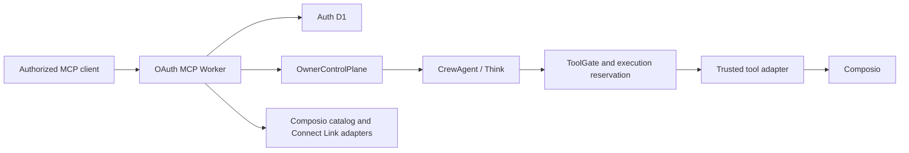

# System architecture

Status: current architecture and non-negotiable boundaries

Crewhelm is an authority layer over two infrastructure bets: Cloudflare provides authenticated
ingress and durable execution; Composio provides app and web integrations. Firecrawl is one
Composio toolkit, not a Crewhelm subsystem.

This document answers three questions: where a request goes, who owns each fact, and which
boundaries must not be bypassed. Detailed controls live in the
[security invariants](../security/invariants.md), [threat model](../security/threat-model.md), and
[ADRs](../decisions/).

## Runtime shape



The Worker authenticates the request, derives owner and client authority, and creates a fresh MCP
server, handler, and transport for that request. MCP handlers translate protocol input into
commands; they do not read SQL, agent storage, or credentials.

There is one SQLite-backed `OwnerControlPlane` Durable Object per owner and one name-addressed
`CrewAgent` Durable Object per logical agent. Never route multiple owners through a global control
plane.

## State ownership

| Owner               | Authoritative facts                                                                               |
| ------------------- | ------------------------------------------------------------------------------------------------- |
| MCP Worker          | Authenticated request context only                                                                |
| Auth D1             | OAuth protocol state, signing keys, and token revocation                                          |
| `OwnerControlPlane` | Agent revisions, connection references, run admission, budgets, approvals, idempotency, and audit |
| `CrewAgent`         | Think submissions, transcript state, run output, deadlines, and tool-approval waits               |
| Composio            | Connected-account credentials and refresh                                                         |

The control plane owns admission and administration; the agent owns execution. Cross-object calls
carry explicit authority and are idempotent because Durable Objects do not share transactions.
D1 is not an authoritative store for agent or control-plane domain state.

The control-plane composition root delegates cohesive behavior to deep modules:

| Module                   | Responsibility                                                            |
| ------------------------ | ------------------------------------------------------------------------- |
| `agent-registry.ts`      | Agent creation, immutable revisions, reads, and pagination                |
| `run-admission.ts`       | Run permits, budget reservations, replay protection, and cleanup          |
| `tool-execution.ts`      | Execution-time policy evaluation, reservations, approvals, and completion |
| `owner-control-plane.ts` | Owner authorization, cross-object coordination, and module composition    |
| `crew-agent.ts`          | Admitted Think execution and durable run lifecycle                        |

Keep focused tests beside these implementations. Add a module when it hides a coherent policy or
state transition behind a small interface—not merely to shorten a file.

## Authority boundaries

### Identity and ingress

Build the owner key only from verified issuer and subject claims. Do not use email, username,
model input, or free-form claims. The Worker validates token authenticity, issuer, audience,
subject, expiry, client, resource, and operation scope before selecting an owner object. Bearer
tokens never cross the Worker boundary.

Typed RPC is not authorization. Every owner-object entrypoint validates owner binding and scope.
MCP and HTTP callers never receive a Durable Object namespace, object stub, or raw storage handle.

### Run admission

`OwnerControlPlane` issues a short-lived, single-use permit bound to the owner, client, exact Agent
revision, run, prompt digest, idempotency key, and reserved budget. `CrewAgent` redeems that permit
before submission, rechecks the current revision, and claims reserved model work immediately
before inference.

A claimed provider call is spent. Recovery may resume work only before provider execution starts;
Crewhelm does not silently replay interrupted paid inference.

Think remains behind Crewhelm-owned methods. Authority-bearing inherited entrypoints stay blocked,
and the inherited surface is fingerprinted so dependency upgrades force review. Grant-free turns
expose no actions: `workspaceBash = false`, `includeMcpTools = false`, and tool inventories default
empty.

### Tool execution

Tool discovery is not authorization. Effective authority is the intersection of the exact Agent
grant, connected account, current policy and revocation state, target/effect restrictions, and
remaining budget.

Every effect reaches `ToolGate` immediately before execution. An allow decision alone is not an
execution permit. The execution owner must atomically reserve current budget, rerun policy, and
issue a short-lived, single-use permit for one exact adapter call. Duplicate or unknown outcomes
fail closed until reconciled. Write and destructive approval-required actions remain unavailable
without separate owner evidence bound to the exact action.

The production tool adapter is not wired yet. A grant with no trusted adapter exposes no model tool
and reaches no provider.

Composio discovery is open-world, but execution is exact: grants bind toolkit, tool, version,
connected account, effect, targets, and limits. Never fall through to `latest` or automatic account
selection. Do not expose Composio Sessions, raw proxy execution, connection-management meta-tools,
or model-managed credentials. Provider schemas, classifications, errors, and results are untrusted
input.

Connect Links are owner-facing setup flows. A browser return records lifecycle evidence; it is not
a signed provider assertion, does not activate a connection, and cannot create a grant or
execution permit.

## Storage and recovery

The control-plane schema is declared once with Drizzle. Ordered, checksummed migrations run before
RPC admission; unknown or changed migration state fails closed. Deployed Durable Object class
bindings and SQLite declarations roll forward even when callers are disabled. Recovery that
changes or deletes stored state requires explicit approval.

Exact migration and Durable Object recovery requirements are recorded in
[ADR 0002](../decisions/0002-owner-scoped-durable-object-control-plane.md). OAuth storage is
recorded in [ADR 0004](../decisions/0004-better-auth-on-d1.md).

## Dependency direction

```text
entrypoints -> application commands -> domain policy and contracts
adapters ---------------------------> application ports and contracts
composition roots -----------------> concrete implementations
```

Contracts import no Cloudflare, Think, MCP, Composio, database, or environment APIs. Only
composition roots read the full environment. Modules receive the narrow database, namespace, or
adapter they need. Provider adapters do not decide authority, and policy modules do not perform
provider I/O.

Prefer a pass-through composition root when validation and policy already live in the called
module. Keep orchestration in the root only when it coordinates multiple state owners or converts
one authority into a narrower capability. See [module design](../engineering/module-design.md) for
the boundary test.
