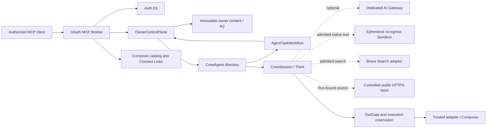

# System architecture

Status: current ownership and dependency map

Crewhelm is an authority layer over Cloudflare execution and Composio integrations. Detailed
controls live in the [security invariants](../security/invariants.md) and
[threat model](../security/threat-model.md).

## Runtime



The Worker authenticates requests, derives owner and client authority, and creates a fresh MCP
server per request. There is one SQLite-backed `OwnerControlPlane` per owner, one name-addressed
`CrewAgent` directory per logical Agent, and one isolated `CrewSession` runtime per durable
conversation. A Cloudflare `AgentTaskWorkflow` may coordinate one frozen ordered plan by asking the
owner control plane to admit each stage as a normal Run. Retained pre-session runs remain readable
through the Agent object during migration.

| State owner          | Authoritative facts                                                                                                                                                            |
| -------------------- | ------------------------------------------------------------------------------------------------------------------------------------------------------------------------------ |
| Worker               | Authenticated request context only                                                                                                                                             |
| Auth D1              | OAuth state, signing keys, rotating refresh tokens, and token revocation                                                                                                       |
| `OwnerControlPlane`  | Agent and connection lifecycle, grants, Briefs, Watches and schedules, Workflow plans and projections, Run admission, owner inbox, approvals, effect reconciliation, and audit |
| Owner content R2     | Immutable Skill files, versioned Brief content, and final Workflow deliverables; owner-local SQLite holds metadata, digests, provenance, and lifecycle                         |
| `CrewAgent`          | Workflow and Session discovery, branch revisions, retention, deletion, and exact event and Run routing                                                                         |
| `AgentTaskWorkflow`  | Durable ordering of identifiers and stage events; no prompts, bearer authority, provider access, or policy decisions                                                           |
| `CrewSession`        | One conversation's Think transcript, submissions, output, deadlines, and approval waits                                                                                        |
| Sandbox container    | One runtime-tool call's ephemeral process and filesystem; never owner authority or credentials; its backing Durable Object is purged after teardown                            |
| Search/fetch adapter | Bounded public evidence reads; provider credentials stay in the Worker and exact source handles expire with their Run                                                          |
| AI Gateway           | Optional installation-wide hard spend ceiling and model-call cost metadata                                                                                                     |
| Composio             | Connected-account credentials and refresh                                                                                                                                      |

The control plane owns admission and administration; the Agent directory owns conversation
lifecycle; each session owns execution. Cross-object calls
carry explicit authority because Durable Objects do not share transactions. D1 is not an
authoritative store for control-plane or Agent domain state.

Optional installation features have three separate states: provider-plan eligibility,
installation enablement, and Agent enablement. The CLI owns plan checks, explicit activation, and
infrastructure readiness; MCP reports bounded prerequisite and setup metadata but does not infer
account billing state or grant the capability. Default installation and upgrade paths omit paid
Container runtime infrastructure. The inert Sandbox class export remains registered so an
already-enabled installation can safely opt out without an invalid Durable Object deletion; no
Sandbox binding or Container application is configured until explicit activation. An explicit
opt-out returns the installation to the Free-compatible core.

Session deletion is revision-bound and idempotent. An ambiguous deletion remains sealed beyond
ordinary session retention until the exact request retries, preserving owner redaction and audit
recovery without reopening an empty conversation.

Workflow start freezes the owner, Agent and fleet revisions, exact Brief revisions and aggregate
context digest, objective, ordered stages, aggregate budget, and retention in the owner control
plane before coordination begins. The Workflow runtime
receives only opaque owner, Agent, Workflow, and stage-count coordinates. It cannot mint Run
permits, add stages, read prompts, call providers, or interpret model output as authority. Every
stage returns through the existing admission path and executes in one exact Workflow-owned Session.
That Session is hidden from ordinary discovery and rejects direct continuation or deletion, so only
the owning Workflow can advance its branch until terminal cleanup.

Briefs are bounded, explicit owner inputs rather than Agent capabilities. Each immutable revision
is stored behind a Crewhelm-owned object-store adapter; the control plane keeps only compact
metadata and verifies content and digest before admission. The exact rendered context is frozen
before a Run permit is issued and passed to `CrewSession` with that permit. `beforeTurn` may use
only this admitted payload and never discovers or refreshes Briefs. A successful final Workflow
stage commits one digest-bound deliverable with exact Workflow, stage, and Run provenance. Default
inspection returns metadata only; exact opt-in inspection reads content. Workflow deletion removes
the deliverable before its owner projection. A durable upload intent repairs interruption between
object storage and the final Workflow transition. Session Run cleanup removes raw Brief blocks from
retained turn metadata; the owner keeps its Brief reference until the Session acknowledges that
redaction has completed.

A direct Run or final Workflow stage may freeze a bounded object-root JSON output contract. The
contract and schema digest cross the same admission capability as the prompt, context, Agent,
fleet, and budget revisions. `CrewSession` independently validates terminal model output and may
spend at most one admitted tool-free repair attempt, using only the frozen inference route and its
bounded fallbacks, to repair formatting. Valid content is stored
canonically with content and schema digests; invalid content makes the Run fail while preserving
tool-effect evidence. Ordinary inspection exposes metadata only, and exact JSON content is an
explicit read. Intermediate Workflow stages remain Markdown.

Runs and tool calls are bound to the admitted Agent and fleet-configuration revisions.
Each Agent may also own a bounded collection of independently named recurring schedules. A
schedule has an opaque identity and immutable, Agent-global revision history; each revision freezes
the exact Agent revision, prompt, and either an elapsed interval or a daily, weekly, or monthly
wall-clock trigger with an explicit IANA time zone. Alarm claims advance each schedule directly to
its next future occurrence, so late alarms do not replay a backlog. Agent revision changes pause
stale schedules before admission, while schedule IDs flow into deferred inbox projections and
schedule-specific audit events. Scheduled Run discovery retains the originating schedule ID and
revision. Each Agent has eight bounded schedule slots; an owner reclaims capacity by exactly
updating a paused schedule, retaining one auditable identity and revision chain for that slot.

The owner-facing Watch lifecycle initially presents those recurring checks as “every N minutes,
ask this Agent to check,” without exposing alarm or webhook configuration. A Watch occurrence is
recorded before dispatch, receives one deterministic scheduled-Run idempotency key, and remains
recoverable if the alarm stops after admission but before its outcome is recorded. Inspectable
history distinguishes pending, dispatched, and skipped occurrences; Crewhelm retains the latest
100 terminal occurrences per Watch. Only one occurrence from a Watch is claimed per alarm, and a
pending admission must settle before pause, resume, update, or deletion so history never hides an
already-started Run. Lifecycle changes are revision-bound; deletion redacts prior Watch definitions,
leaves an auditable tombstone revision, releases the Agent's Watch capacity, and hides the Watch
from ordinary reads. Connected event and resource sources extend this lifecycle rather than creating
provider-specific automation objects.

An Agent capability module may contribute a native runtime-tool descriptor, but only the owner
control plane can freeze it into a Run plan and reserve its shared tool-call budget. `CrewSession`
redeems a short-lived permit for the exact call, dispatches through a Crewhelm-owned adapter, and
records completion or uncertainty. The first native tool, `sandbox.code`, creates one isolated
container per call, blocks network egress, exposes no Crewhelm credentials, returns only bounded
textual output, and destroys the container after execution. The owner ledger retains the exact
container identity and repeats cleanup across the bounded late-open window before releasing the
Run's storage target.

`web.search` sends one bounded query through a Crewhelm-owned Brave Search adapter and returns only
normalized public HTTPS evidence. Each result receives an HMAC source handle bound to the active
Run and exact normalized URL. `web.fetch` accepts that handle unchanged or one direct public HTTPS
URL, follows a small number of revalidated public HTTPS redirects, accepts configured textual media
types, and bounds response bytes, normalized output, and wall time. Search and fetch are public
reads, so interrupted calls fail instead of entering external-effect reconciliation and are never
silently replayed. Retrieved titles, snippets, URLs, and page text remain untrusted data.
Configuration changes invalidate unconsumed authority. The optional AI Gateway provides the
fleet-wide dollar ceiling. The
[threat model](../security/threat-model.md#observability-and-deployment) defines telemetry and
cost-reconciliation controls.

## Module map

| Change                                | Owning path                  |
| ------------------------------------- | ---------------------------- |
| Owner authorization and wiring        | `owner/durable-object.ts`    |
| Agent definitions and revisions       | `owner/agents/`              |
| Agent capability registry and plans   | `agent-capabilities/`        |
| Run admission, budgets, and execution | `owner/runs/`                |
| Native runtime-tool adapters          | `agent/admitted-runs/`       |
| Sandbox container boundary            | `sandbox.ts`                 |
| Recurring Agent schedules             | `owner/schedules/`           |
| Owner-facing Watch lifecycle          | `owner/watches/`             |
| Durable Workflow plans and projection | `owner/workflows/`           |
| Cloudflare Workflow coordination      | `agent-workflows/`           |
| Disablement, revocation, recovery     | `owner/recovery/`            |
| Connection lifecycle                  | `owner/connections/`         |
| Skill package lifecycle               | `owner/skills/`              |
| Brief and deliverable lifecycle       | `owner/briefs/`              |
| Owner inbox and Agent capabilities    | `owner/agent-channel/`       |
| Session directory and lifecycle       | `agent/session-directory.ts` |
| Admitted Think execution              | `agent/admitted-runs/`       |
| MCP presentation                      | `mcp/*-tools.ts`             |
| Public routing and bounded HTTP input | `http/`                      |
| OAuth persistence and protocol        | `oauth/`                     |
| Shared visual foundations             | `packages/design/`           |

Entrypoints compose capability modules. Each module exposes its public API through `index.ts`;
policy, persistence, transactions, and failure handling remain internal.

Browser runtimes own their document shells, escaping, response headers, content security policy,
forms, and interaction behavior. `packages/design/` supplies only dependency-free tokens,
branding, stylesheet assets, and terminal color roles.

## Authority flow

1. The Worker verifies identity and scope, then selects the owner object. Bearer tokens stop at the
   Worker.
2. `OwnerControlPlane` revalidates authority, compiles validated Agent modules into an immutable
   runtime plan, and issues a bounded single-use permit against the exact Agent and fleet revisions.
3. `CrewAgent` resolves or creates one exact session and branch revision. `CrewSession` redeems the
   unchanged permit, verifies any frozen Brief payload against its admitted digest, freezes a
   bounded transcript snapshot, and only then submits inference.
   Discovery, session coordinates, and configuration grant no execution authority.
4. `ToolGate` rechecks the grant, policy, connection, effect, approval, and budget before Composio
   dispatch. A native runtime tool instead redeems a narrow owner-issued permit for its exact
   admitted descriptor, input digest, and shared call budget before its Crewhelm adapter runs.
   Ambiguous dispatches remain blocked or recorded unknown until recovery.
5. Schedules and Workflow stages use the same admission path. A Workflow stage is admitted only
   from its exact frozen owner record and continues the exact Workflow Session; duplicate terminal
   events and retries cannot advance a different stage.
6. Projections support discovery, never authority. Connect Links record setup lifecycle but do not
   activate or authorize connections.

Control-plane migrations are ordered and checksummed; incompatible state fails closed. Upgrade
compatibility is package-forward: current upgrade tooling can read the prior server's bounded
fixtures, while an older strict CLI is not supported against a newer Worker. Installation upgrades
replace and validate the packaged CLI and Worker together.

## Dependency direction

```text
entrypoints -> capability modules -> domain policy and contracts
adapters ------------------------> ports and contracts
composition roots --------------> concrete implementations
```

Contracts import no runtime, provider, database, or environment APIs. Only composition roots read
the full environment. Provider adapters do not decide authority, and policy modules do not perform
provider I/O. See the [MCP architecture](mcp.md) for fleet-query and tool-surface rules, and
[engineering design](../engineering/design.md) for the boundary test.
