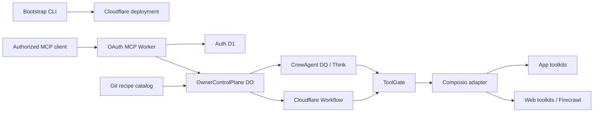

# System architecture

Status: target architecture for the first vertical slice

Crewhelm is a thin authority layer over two bets: Cloudflare for durable execution and Composio
for app and web integrations. Firecrawl is one Composio toolkit, not a Crewhelm subsystem.
Ownership and trust boundaries are strict; libraries and package layout may change.

## Runtime



The CLI handles Cloudflare deployment, MCP authentication setup, the Composio project secret, and
health checks. Once healthy, MCP owns administration.

| Layer      | Job                                                                                                             |
| ---------- | --------------------------------------------------------------------------------------------------------------- |
| Crewhelm   | Identity, recipes, grants, budgets, approval, audit, admission, and tool policy                                 |
| Cloudflare | MCP ingress, owner and agent state, Think turns, durable workflows, and artifacts                               |
| Composio   | The integration plane: 1,000+ app and web toolkits, connected accounts, token refresh, discovery, and execution |

Crewhelm does not rebuild integrations already served by Composio. Recipes select Firecrawl or
another catalog tool without changing Crewhelm core.

## State ownership

| Owner               | Authoritative facts                                                                                                                                                   |
| ------------------- | --------------------------------------------------------------------------------------------------------------------------------------------------------------------- |
| MCP Worker          | Authenticated request context only                                                                                                                                    |
| Auth D1             | OAuth clients and leases, login sessions, authorization codes and consent, signing keys, and token revocations                                                        |
| `OwnerControlPlane` | Agent and recipe revisions, connection references, grants, `ScheduleSpec`, `RunAdmission`, budgets, approval policy, administrative lifecycle, idempotency, and audit |
| `CrewAgent`         | Think sessions, workspace, materialized schedules, `TurnExecution`, transcript, tool records, and agent-action approval waits/evidence                                |
| Workflow            | Its `WorkflowExecution`, checkpoints, retries, waits, and approval evidence                                                                                           |
| Composio            | Connected-account credentials and refresh                                                                                                                             |
| Git                 | Public recipe source before installation                                                                                                                              |
| R2 bucket           | Large artifacts                                                                                                                                                       |
| Future domain D1    | Rebuildable search, marketplace, or analytics projections—not domain authority                                                                                        |

The control plane owns admission and administration, the agent owns turns, and a Workflow owns its
steps. Any control-plane runtime status is a timestamped projection, never a second source of
truth. Cross-object work is idempotent because Durable Objects do not share transactions.

Use one SQLite-backed control-plane object per owner and one name-addressed agent object per
logical agent. Never use a global control-plane object. D1 is not an authoritative store for
control-plane or agent domain state in the individual release; the auth D1 database is narrowly
authoritative for OAuth protocol state. See
[ADR 0002](../decisions/0002-owner-scoped-durable-object-control-plane.md) and
[ADR 0004](../decisions/0004-better-auth-on-d1.md).

### Durable Object lifecycle and recovery

Declare new SQLite-backed classes with Wrangler's `exports` lifecycle map. After a class has been
deployed, a recovery release must roll forward: retain the class export, binding, and SQLite
storage declaration while disabling or reverting callers. Do not use a source-control revert or
Workers version rollback that removes an established class lifecycle declaration.

Before a recovery deployment, run the object eviction/reconstruction tests and a Wrangler dry-run.
If a bad release changed stored state, block new admissions first and use Cloudflare's SQLite
point-in-time recovery before re-enabling callers. Namespace deletion or a lifecycle tombstone is a
separate destructive operation and requires explicit approval.

## Identity and references

Build the owner principal only from verified OAuth issuer and subject claims, plus a tenant claim
only when its issuer validates it. Convert that tuple to a stable opaque, non-PII owner key; never
use email, username, model input, or a free-form claim.

The control plane generates agent IDs. Agent object names derive from owner key plus agent ID.
Every workflow, connection, secret reference, and artifact is owner-namespaced. Callers never
choose raw object names or secret references; opaque references are unguessable, sensitive, and
redacted.

Typed RPC is not authorization. Every cross-object command and short-lived execution permit binds
owner, client, run, agent revision, capability, connection, normalized target/effect, budget
reservation, expiry, nonce, and idempotency key. The receiver verifies the permit and current
revocation state.

## Recipes

A recipe may declare instructions, model requirements, Composio toolkits and tools, connection
requirements, schedules, and limits. It contains no executable code, credential, unrestricted
destination, tool implementation, or grant.

Ingestion accepts bounded inert data through a closed schema. Fetch only from allowed sources and
pin a commit, not a branch or tag. Never run repository hooks, scripts, submodules, or declared
commands; reject path traversal and symlinks. Store canonical content, digest, source, and schema
version as an immutable installed revision.

Before install or update, show the validated capability diff—not recipe prose. An update creates a
new revision and never inherits wider authority without owner consent.

## Agent runtime

One generic `CrewAgent` class executes every recipe on Think. Think stays behind Crewhelm-owned
contracts.

Crewhelm adapters preserve the useful semantics of the underlying Agents/Think framework and make
its lifecycle administrable through MCP. The adapter boundary centralizes authority, recovery, and
compatibility; it is not a permanently reduced substitute for the framework. Framework features
can remain unavailable only until an equivalent deterministic policy and recovery path exists.

Crewhelm builds a default-empty effective tool registry. Each executable path has one stable
capability ID independent of its model-visible name; duplicate or overriding names fail startup.
After Think merges tools, the runtime enumerates the final set and rejects any unmapped path.

Composio catalog discovery is not restricted by a Crewhelm-maintained toolkit allowlist. Any
catalog integration may be connected and granted by the owner through its exact toolkit, tool,
version, and connected-account identity. Sessions, raw proxy calls, and model-managed connections
remain outside the execution path because they bypass that exact grant boundary, not because their
underlying integrations are unsupported.

Harden Think explicitly:

- `workspaceBash = false`, `includeMcpTools = false`, and `authorizeTurn()` fails closed.
- `beforeTurn()` exposes only effective tools; `authorizeAction()` and `beforeToolCall()` call
  `ToolGate`.
- Caller client tools, executable skills, dynamic extensions, Code Mode, browser tools, and raw
  MCP paths are off until a reviewed adapter proves equivalent gating.
- Workspace read/write/edit/delete tools require explicit capability mappings.

Cloudflare Actions are experimental. Keep them behind a pinned Crewhelm adapter; their ledger and
authorization defaults never replace Crewhelm policy or provider idempotency. See
[ADR 0003](../decisions/0003-declarative-recipes-and-hardened-think.md).

Every child agent is admitted by the control plane. Its capabilities, connections, targets, budget,
lifetime, concurrency, and depth are strict subsets of the parent reservation. Carry lineage,
propagate cancellation and revocation, audit delegation, and never give a child administrative MCP
authority. Raw Think spawning paths cannot bypass this wrapper.

Use Agents for identity, conversation, memory, streaming, short turns, schedules, and short bounded
effects with stable idempotency and unknown-outcome reconciliation. Use Workflows for multi-step
jobs, retries, long waits, durable approvals, and effects whose recovery history matters. A model
may perform a Workflow step; it is not the workflow engine.

## Tool execution

Tool discovery is not authorization.

Effective authority is:

```text
recipe request
∩ owner grant
∩ connection scope
∩ runtime allowlist
∩ budget
∩ current revocation and kill-switch state
```

Every call reaches `ToolGate` immediately before execution. A connector receives only a verified
execution permit and opaque connection reference. It constrains targets, time, output, concurrency,
egress, and cost; propagates cancellation; normalizes untrusted results; and emits safe errors.
Telemetry contains only allowlisted metadata and correlation IDs—never raw provider bodies,
headers, URLs, credentials, or exceptions.

The pure policy layer evaluates one classified Composio action against one immutable exact grant
and an authoritative current policy and budget snapshot. Raw tool arguments and target values do
not enter this layer; trusted adapters supply canonical input and target digests plus an explicit
effect and known cost. The snapshot is itself bound to the exact owner, Agent revision, run, grant,
capability, and connection before its status or budget values are used. ToolGate derives the
complete canonical action digest. The decision binds owner, Agent revision, run, tool call,
capability, connection, exact toolkit/tool/version, effect, targets, and the tightest time, output,
and cost limits. Snapshot freshness and grant expiry are checked against the evaluator's trusted
current time; future-dated or more than five-second-old snapshots fail closed, and decision expiry
is bounded from both current time and snapshot creation. It also fails closed on malformed input,
inactive policy, cross-object mismatches, unknown cost, and exhausted budgets. Write and
destructive effects require distinct owner approval.

An in-process allow decision is deliberately not a verified execution permit, does not reserve a
budget, and cannot authorize a connector or cross an object boundary. The execution owner must
atomically reserve current budget, rerun policy immediately before the effect, and issue the
short-lived verified permit described above. Until that seam exists, no decision reaches a
provider.

### Composio

Composio is the default path to third-party apps. Crewhelm maps its opaque owner key to a stable
Composio user ID and stores only opaque auth-config and connected-account references. Composio owns
raw credentials and refresh; Crewhelm never retrieves credential state.

Use catalog APIs for discovery and direct tool execution for runs. Each grant snapshots the schema
and binds an exact tool slug, toolkit version, effect class, and connected account. After
`ToolGate`, execute with those exact values; never fall through to `latest` or automatic account
selection.

Do not expose Composio Sessions, MCP, connection-management meta-tools, remote Bash/workbench,
multi-execute, or proxy-execute to the model. Catalog search is read-only; batches expand into
separately permitted direct calls.

Composio schemas, behavior tags, and results are untrusted provider input, not Crewhelm authority.
Unknown tools remain unavailable until classified. Grants bind exact tool slugs, toolkit versions,
and effect classes; open-world tools also bind targets and budgets.

Connection setup returns a Composio Connect Link through an owner-facing MCP flow; completing the
provider consent remains a human action. Each link carries a short-lived Crewhelm callback
capability bound to the exact owner, reservation, and connected-account reference. Its browser
return records only `pending`, `returned`, `failed`, `expired`, or legacy `untracked` lifecycle
evidence. The Worker authenticates callback routing before selecting an owner Durable Object; the
owner object then enforces the one-time stored binding. Because the browser redirect is not a
signed provider assertion, it never marks a connection active and never creates a grant or
execution permit. Keep the Composio project key in a Cloudflare secret, separate environments into
separate Composio projects, and never expose the key to a model.

Web tools such as Firecrawl use the same boundary. Constrain domains, pages, depth, concurrency,
time, output, and cost; treat results as hostile. Arbitrary headers, cookies, TLS bypass, robots
overrides, browser code, and autonomous research require separate grants. Long provider jobs
persist their external ID and resume through a Workflow.

## Approval and revocation

Approval is owner-authenticated evidence from an interaction distinct from model output. It binds
owner, client, run, revision, tool, canonical input/target/effect/cost digest, expiry, and nonce.
The requesting model cannot approve or call the approval path. Until Crewhelm has such a channel,
approval-required actions remain unavailable.

The execution owner stores the wait and immutable decision evidence; the control plane owns who may
approve. After approval, run `ToolGate` again against current grants, connection, budget,
revocation, and kill switch immediately before the side effect.

Revocation or deletion first blocks new admissions and permit verification, invalidates pending
approvals, then sends idempotent cancellation to schedules, queued turns, workflows, and connector
caches. Completed provider effects cannot be recalled; record and reconcile them.

## MCP command path

The Worker is an OAuth 2.1 resource server over Streamable HTTP. Validate token authenticity
through either a signature or an active opaque-token lookup, bind the authorization server or
issuer, and validate audience/resource, subject, expiry, client ID, and operation scopes. The
individual release uses Better Auth's OAuth provider with signing keys and protocol state in D1.
It issues 15-minute JWTs for the exact `/mcp` resource and checks a D1 denylist of token hashes for
immediate explicit revocation. The authenticated subject is an opaque owner key derived only from
the configured, GitHub-verified numeric ID. Deny missing context and never forward bearer tokens.

Create a fresh MCP server, handler, and transport per request. Never share a module-global instance
across clients.

```text
authenticate -> validate -> derive owner/client authority
-> create command/query -> OwnerControlPlane RPC -> safe response
```

Mutation idempotency records are scoped by owner, client, operation, and key, and bind a canonical
validated-request digest. Reject reuse with different input. External effects use stable domain
identifiers and reconcile an unknown provider result before retry.

Handlers never read SQL or secrets, construct provider clients, or access agent storage.

## Dependency direction

```text
entrypoints -> application commands/queries -> domain policy/contracts
external adapters -------------------------> application ports/contracts
composition roots -------------------------> concrete implementations
```

Contracts import no Cloudflare, Think, MCP, Composio, Firecrawl, database, or environment APIs.
Only composition roots read the full environment. They pass narrow bindings to adapters; designated
adapters may construct scoped SDK clients. Create packages only when a working slice earns the
boundary.

Likely first boundaries are `apps/cli`, `apps/worker`, and
`packages/{contracts,core,cloudflare,composio,testkit}`. This keeps Pi's separation of provider,
agent loop, and entrypoint while adding Crewhelm's permission boundary.

## Required evidence

Add each check with the first slice it protects:

- import-boundary and runtime-schema tests;
- recipe ingestion, digest, capability-diff, and no-code fixtures;
- a final Think tool inventory proving every path reaches `ToolGate`;
- negative tests for OAuth claims, cross-owner references, permits, approvals, revocation, and
  child attenuation;
- Durable Object and Workflow tests for duplicates, stale revisions, eviction, retry, and
  recovery; and
- Composio contract tests for version drift, limits, redaction, cancellation, and unknown outcomes.

Changes to a strict invariant, trust boundary, state owner, or dependency direction are R3. Public
contracts are R2 by default. Write an ADR only for a durable, hard-to-reverse choice.

## Sources

- [Cloudflare Think](https://developers.cloudflare.com/agents/harnesses/think/)
- [Cloudflare Agents with Workflows](https://developers.cloudflare.com/agents/concepts/workflows/)
- [Cloudflare MCP handler](https://developers.cloudflare.com/agents/model-context-protocol/apis/handler-api/)
- [Composio direct tool execution](https://docs.composio.dev/docs/tools-direct/executing-tools)
- [Composio toolkit versioning](https://docs.composio.dev/docs/tools-direct/toolkit-versioning)
- [Composio authentication](https://docs.composio.dev/docs/authentication)
- [Composio Firecrawl toolkit](https://docs.composio.dev/toolkits/firecrawl)
- [Pi agent harness](https://github.com/earendil-works/pi)
