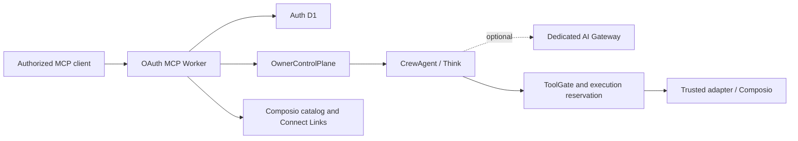

# System architecture

Status: current ownership and dependency map

Crewhelm is an authority layer over Cloudflare execution and Composio integrations. Detailed
controls live in the [security invariants](../security/invariants.md) and
[threat model](../security/threat-model.md).

## Runtime



The Worker authenticates requests, derives owner and client authority, and creates a fresh MCP
server per request. There is one SQLite-backed `OwnerControlPlane` per owner and one name-addressed
`CrewAgent` per logical Agent.

| State owner         | Authoritative facts                                                                                                    |
| ------------------- | ---------------------------------------------------------------------------------------------------------------------- |
| Worker              | Authenticated request context only                                                                                     |
| Auth D1             | OAuth state, signing keys, rotating refresh tokens, and token revocation                                               |
| `OwnerControlPlane` | Agent and connection lifecycle, grants, schedules, admission, owner inbox, approvals, effect reconciliation, and audit |
| `CrewAgent`         | Think submissions, transcripts, output, deadlines, and approval waits                                                  |
| AI Gateway          | Optional installation-wide hard spend ceiling and model-call cost metadata                                             |
| Composio            | Connected-account credentials and refresh                                                                              |

The control plane owns admission and administration; the Agent owns execution. Cross-object calls
carry explicit authority because Durable Objects do not share transactions. D1 is not an
authoritative store for control-plane or Agent domain state.

Runs and tool calls are bound to the admitted Agent and fleet-configuration revisions.
Configuration changes invalidate unconsumed authority. The optional AI Gateway provides the
fleet-wide dollar ceiling. The
[threat model](../security/threat-model.md#observability-and-deployment) defines telemetry and
cost-reconciliation controls.

## Module map

| Change                                | Owning path               |
| ------------------------------------- | ------------------------- |
| Owner authorization and wiring        | `owner/durable-object.ts` |
| Agent definitions and revisions       | `owner/agents/`           |
| Run admission, budgets, and execution | `owner/runs/`             |
| Recurring Agent schedules             | `owner/schedules/`        |
| Disablement, revocation, recovery     | `owner/recovery/`         |
| Connection lifecycle                  | `owner/connections/`      |
| Owner inbox and Agent capabilities    | `owner/agent-channel/`    |
| Admitted Think execution              | `agent/admitted-runs/`    |
| MCP presentation                      | `mcp/*-tools.ts`          |
| Public routing and bounded HTTP input | `http/`                   |
| OAuth persistence and protocol        | `oauth/`                  |
| Shared visual foundations             | `packages/design/`        |

Entrypoints compose capability modules. Each module exposes its public API through `index.ts`;
policy, persistence, transactions, and failure handling remain internal.

Browser runtimes own their document shells, escaping, response headers, content security policy,
forms, and interaction behavior. `packages/design/` supplies only dependency-free tokens,
branding, stylesheet assets, and terminal color roles.

## Authority flow

1. The Worker verifies identity and scope, then selects the owner object. Bearer tokens stop at the
   Worker.
2. `OwnerControlPlane` revalidates authority and admits work against immutable Agent and fleet
   revisions, issuing a bounded single-use permit.
3. `CrewAgent` redeems the permit before inference. Discovery and configuration grant no execution
   authority.
4. `ToolGate` rechecks the grant, policy, connection, effect, approval, and budget before Composio
   dispatch. Ambiguous mutations remain blocked until reconciled.
5. Schedules use the same admission path. Projections support discovery, never authority. Connect
   Links record setup lifecycle but do not activate or authorize connections.

Control-plane migrations are ordered and checksummed; incompatible state fails closed.

## Dependency direction

```text
entrypoints -> capability modules -> domain policy and contracts
adapters ------------------------> ports and contracts
composition roots --------------> concrete implementations
```

Contracts import no runtime, provider, database, or environment APIs. Only composition roots read
the full environment. Provider adapters do not decide authority, and policy modules do not perform
provider I/O. See the [MCP architecture](mcp.md) for fleet-query and tool-surface rules, and
[engineering design](../engineering/design.md) for the boundary test.
