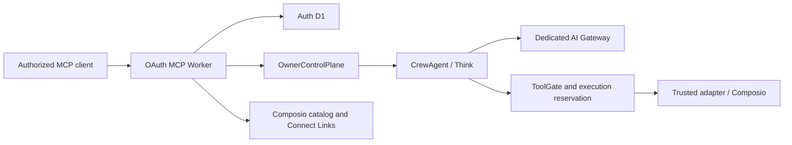

# System architecture

Status: current ownership and dependency map

Crewhelm is an authority layer over Cloudflare execution and Composio integrations. Firecrawl is
one Composio toolkit, not a Crewhelm subsystem. Detailed controls live in the
[security invariants](../security/invariants.md) and [threat model](../security/threat-model.md).

## Runtime



The Worker authenticates requests, derives owner and client authority, and creates a fresh MCP
server per request. There is one SQLite-backed `OwnerControlPlane` per owner and one name-addressed
`CrewAgent` per logical Agent.

| State owner         | Authoritative facts                                                                                                |
| ------------------- | ------------------------------------------------------------------------------------------------------------------ |
| Worker              | Authenticated request context only                                                                                 |
| Auth D1             | OAuth state, signing keys, rotating refresh tokens, and token revocation                                           |
| `OwnerControlPlane` | Agent and connection lifecycle, grants, schedules, admission, budgets, approvals, effect reconciliation, and audit |
| `CrewAgent`         | Think submissions, transcripts, output, deadlines, and approval waits                                              |
| AI Gateway          | Installation-wide rolling spend ceiling and model-call cost metadata                                               |
| Composio            | Connected-account credentials and refresh                                                                          |

The control plane owns admission and administration; the Agent owns execution. Cross-object calls
carry explicit authority because Durable Objects do not share transactions. D1 is not an
authoritative store for control-plane or Agent domain state.

Each run snapshots one fleet-configuration revision and reserves spend before execution. Admission,
approval, and tool dispatch require that exact revision to remain current, so an owner policy
change invalidates older authority. The MCP surface can read and preview configuration; applying a
change is reserved for a deterministic owner step-up path outside model authority.

Bootstrap provisions one dedicated AI Gateway per Crewhelm fleet. The Worker reservation is the
fast owner-local guard; the Gateway rolling cost rule is the installation ceiling. Bootstrap reads
and preserves an existing verified rule unless the operator explicitly supplies
`--ai-budget-usd`, deploys the matching Worker configuration, then applies and reads back the
Gateway rule.

Cloudflare Workers Logs provide bounded diagnostic telemetry but do not authorize work or replace
the owner-local audit record. Invocation logs and automatic traces remain disabled because the
Worker handles secret-bearing OAuth and connection callback URLs. The
[threat model](../security/threat-model.md#observability-and-deployment) defines permitted event
data.

AI Gateway logs retain provider/model, token, cost, latency, status, and bounded Crewhelm run and
Agent correlation metadata. Request and response payload logging is disabled. Pending calls retain
their admitted spend reservation until exact Gateway cost reconciliation, including across the
rolling-window boundary.

## Module map

| Change                                | Owning path               |
| ------------------------------------- | ------------------------- |
| Owner authorization and wiring        | `owner/durable-object.ts` |
| Agent definitions and revisions       | `owner/agents/`           |
| Run admission, budgets, and execution | `owner/runs/`             |
| Recurring Agent schedules             | `owner/schedules/`        |
| Disablement, revocation, recovery     | `owner/recovery/`         |
| Connection lifecycle                  | `owner/connections/`      |
| Owner-to-Agent capabilities           | `owner/agent-channel/`    |
| Admitted Think execution              | `agent/admitted-runs/`    |
| MCP presentation                      | `mcp/*-tools.ts`          |
| Public routing and bounded HTTP input | `http/`                   |
| OAuth persistence and protocol        | `oauth/`                  |

`index.ts`, Durable Object entrypoints, and protocol servers are composition roots. They select
authority and connect modules; capability behavior stays in the owning folder. Tests live beside
the behavior they cover.

A capability folder exposes its public API through `index.ts`. Policy, persistence, transactions,
and failure handling remain internal to that folder. Another capability may import its facade, but
not its internal files; shared packages are reserved for provider adapters and stable contracts.

A routine change should require the owning module, its contract, its tests, and at most one
composition root or external adapter. Split only around a coherent invariant or reason to change.

## Authority flow

1. The Worker derives the owner key from verified issuer and subject claims, validates operation
   scope, and selects the owner object. Bearer tokens stop at the Worker.
2. `OwnerControlPlane` revalidates owner binding and scope. For execution it issues a short-lived,
   single-use permit bound to the exact Agent revision, run, prompt, idempotency key, and budget.
3. `CrewAgent` redeems the permit and claims reserved model work before inference. Think's
   authority-bearing inherited entrypoints remain blocked.
4. Tool discovery grants no execution authority. Configuring an Agent connection verifies the
   exact active Composio account, snapshots bounded public schemas for selected pinned versions,
   and creates a new immutable Agent revision.
5. `ToolGate` evaluates the exact grant and current policy immediately before a single-use
   execution reservation. The production adapter atomically consumes the complete permit to claim
   the opaque account once, verifies the account and toolkit again, then executes through
   Composio's fixed direct-tool endpoint. Owner cancellation and provider dispatch race in the
   same control-plane transaction boundary: cancellation is refused after dispatch, and dispatch
   is refused after cancellation.
6. Owner-local alarms claim bounded due schedules, admit exact-revision runs through the same Agent
   channel, and isolate each dispatch so one Agent cannot block unrelated schedules. Each due
   occurrence is claimed at most once; unexpected dispatch failures advance to the next interval
   and leave bounded durable and diagnostic evidence instead of silently retrying work.
7. Agent disablement and connection or capability revocation take effect at admission, approval,
   and dispatch gates. Ambiguous mutating effects remain blocked by their stable effect identity
   until the owner reconciles them from independent evidence.
8. Connect Links create owner-facing setup flows. Browser returns record lifecycle evidence; they
   do not by themselves activate a connection or authorize execution.

Control-plane migrations are ordered and checksummed; incompatible state fails closed before RPC
admission. Auth D1 remains authoritative only for OAuth protocol state.

## Dependency direction

```text
entrypoints -> capability modules -> domain policy and contracts
adapters ------------------------> ports and contracts
composition roots --------------> concrete implementations
```

Contracts import no runtime, provider, database, or environment APIs. Only composition roots read
the full environment. Provider adapters do not decide authority, and policy modules do not perform
provider I/O. See [engineering design](../engineering/design.md) for the boundary test.
